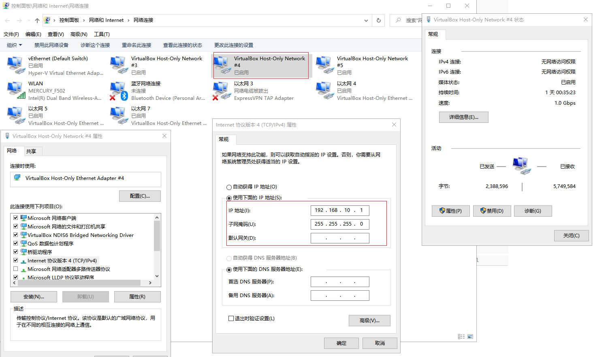

## 环境配置

- window 10 Home x64
- virtualbox 6.1
- centos 7.x

#### 下载需要的文件

1. [centos 镜像](http://mirrors.aliyun.com/centos/7.8.2003/isos/x86_64/CentOS-7-x86_64-DVD-2003.iso)
2. [virtualbox 6.1](https://download.virtualbox.org/virtualbox/6.1.10/VirtualBox-6.1.10-138449-Win.exe)
3. 查看 CPU 虚拟化技术 是否开启


> 在 virtualbox 中安装 centos


网卡 1 不需要修改, `网卡2` 修改如下(`界面名称` 可能和我的不一样, 随便选择一个就可以):


## 初始化 centos 并使用 xshell 连接

#### 网络

- 修改网卡配置

```shell
# 1. 外网连接: 修改 ifcfg-enp0s3
sudo vi /etc/sysconfig/network-scripts/ifcfg-enp0s3

# 将内容修改如下
TYPE=Ethernet
PROXY_METHOD=none
BROWSER_ONLY=no
BOOTPROTO=dhcp    # 自动分配ip地址
DEFROUTE=yes
IPV4_FAILURE_FATAL=no
IPV6INIT=yes
IPV6_AUTOCONF=yes
IPV6_DEFROUTE=yes
IPV6_FAILURE_FATAL=no
IPV6_ADDR_GEN_MODE=stable-privacy
NAME=enp0s3
UUID=806ef1bb-fe4d-4c58-bedf-46268fafca25
DEVICE=enp0s3
ONBOOT=yes        # 开机启动

# 2. 主机连接虚拟机: 修改 ifcfg-enp0s8
sudo vi /etc/sysconfig/network-scripts/ifcfg-enp0s3

# 将内容修改如下
TYPE=Ethernet
PROXY_METHOD=none
BROWSER_ONLY=no
BOOTPROTO=static        # 使用静态的地址
DEFROUTE=yes
IPV4_FAILURE_FATAL=no
IPV6INIT=yes
IPV6_AUTOCONF=yes
IPV6_DEFROUTE=yes
IPV6_FAILURE_FATAL=no
IPV6_ADDR_GEN_MODE=stable-privacy
NAME=enp0s8
UUID=6322b516-7384-4736-a816-3a235b98ddde
DEVICE=enp0s8
ONBOOT=yes               # 开机启动
IPADDR=192.168.10.111    # ip 虚拟机ip地址(这个需要和你的选择的网卡的 ip 是同一网段)
NETMASK=255.255.255.0    # 子网掩码
GATEWAY=192.168.10.1     # 网关

# 2. 重新启动网络服务
sudo service network restart

# 4. 测试网络是否连通

# 外网连接是否正常
ping qq.com -c4

# 主机和虚拟机是否能够通信(主机ip: 192.168.10.1 虚拟机ip: 192.18.10.111)
ping 192.168.10.111 -c4
```



## 使用 阿里云 的镜像

https://developer.aliyun.com/mirror/centos

```shell
# 1. 备份原来配置
sudo mv /etc/yum.repos.d/CentOS-Base.repo /etc/yum.repos.d/CentOS-Base.repo.backup

# 2. 下载阿里云的配置 curl | wget 命令都可以(任意一个就行)
sudo wget -O /etc/yum.repos.d/CentOS-Base.repo https://mirrors.aliyun.com/repo/Centos-7.repo

sudo curl -o /etc/yum.repos.d/CentOS-Base.repo https://mirrors.aliyun.com/repo/Centos-7.repo


# 3. 生成缓存
sudo yum makecache
```
