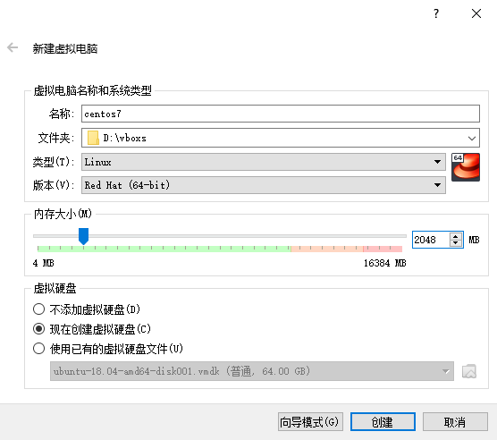
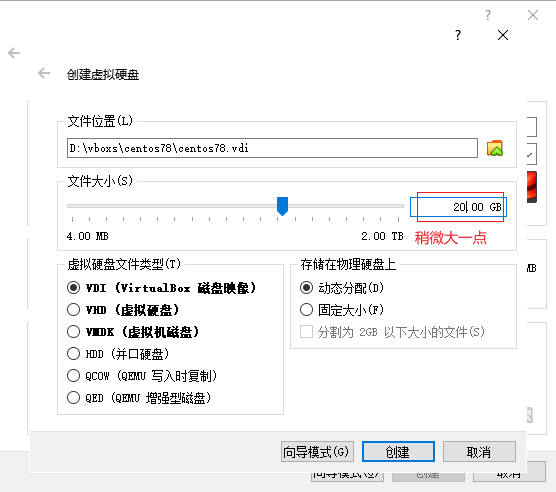
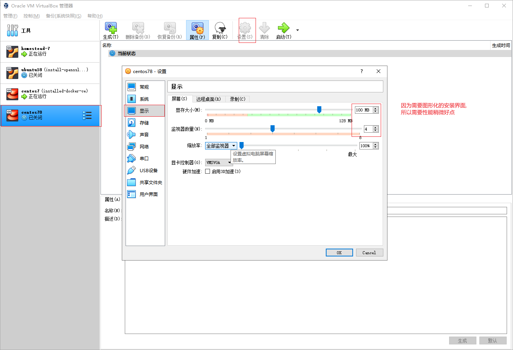
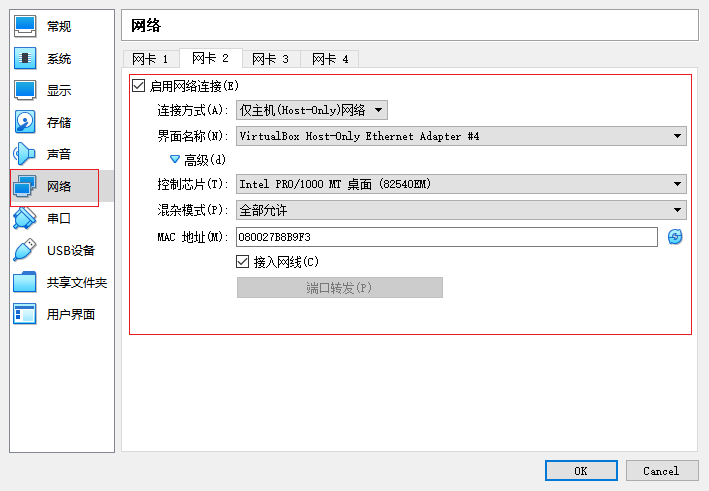
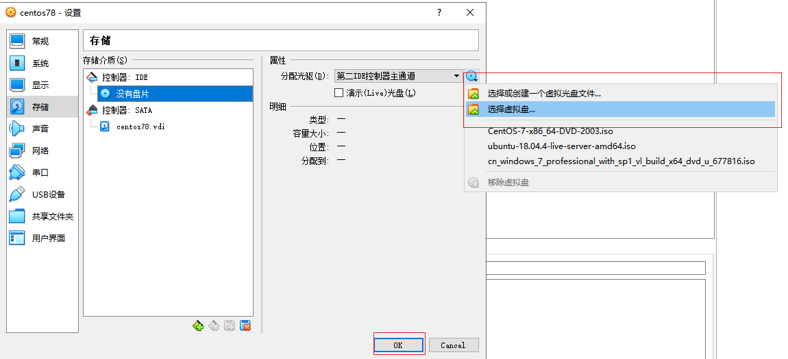
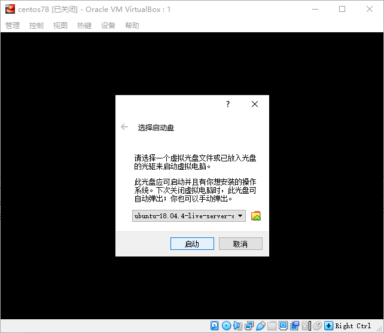
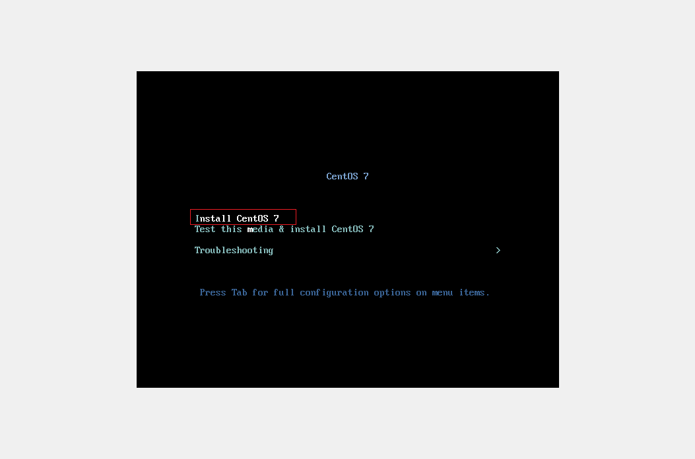
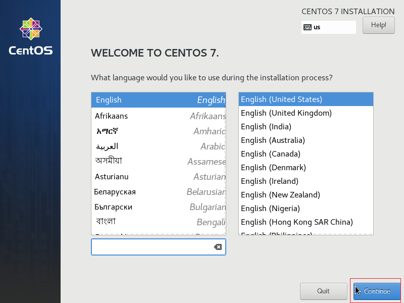
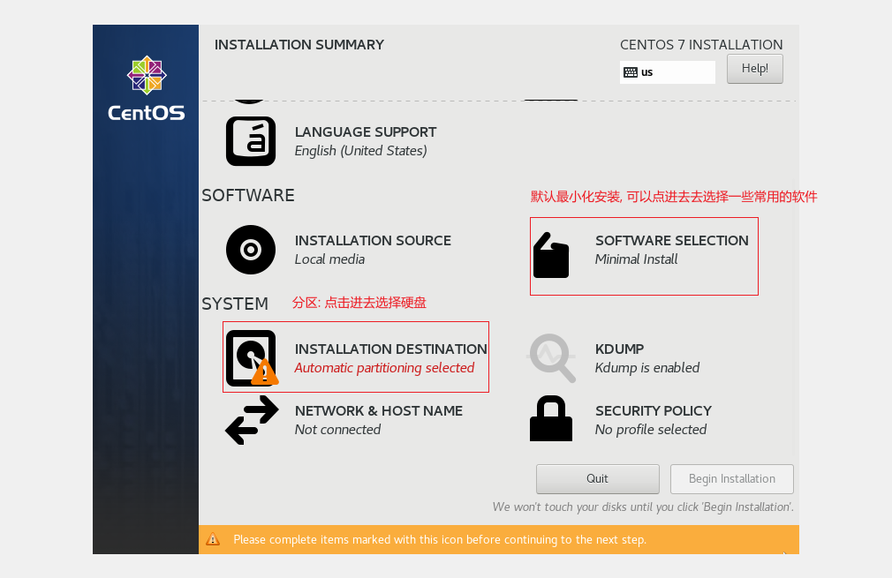
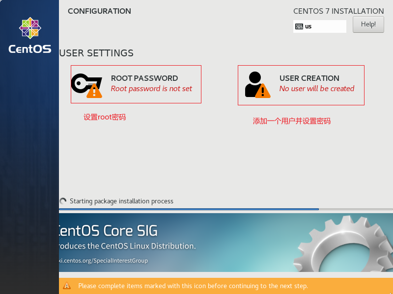

## 环境配置

- window 10 Home x64
- virtualbox 6.1
- centos 7.x

#### 下载需要的文件

1. [centos 镜像](http://mirrors.aliyun.com/centos/7.8.2003/isos/x86_64/CentOS-7-x86_64-DVD-2003.iso)
2. [virtualbox 6.1](https://download.virtualbox.org/virtualbox/6.1.10/VirtualBox-6.1.10-138449-Win.exe)
3. 查看 CPU 虚拟化技术 是否开启


> 在 virtualbox 中安装 centos







网卡 1 不需要修改, `网卡2` 修改如下(`界面名称` 可能和我的不一样, 随便选择一个就可以):















## 配置网络

### 宿主机设置

1. 配置 virtualbox 虚拟网卡


2. 设置虚拟机网络(桥接网络连接外网, host-only 让宿主机可以连接虚拟机)


### 虚拟机设置

> 登录虚拟机, 然后修改网卡(ifcfg-enp0s3(桥接网络), ifcfg-enp0s3(host-only))

> centos7 网卡的位置在: `/etc/sysconfig/network-scripts/` 目录下:

1. 配置内网, 让宿主机可以连接虚拟机

```sh
# 1.修改 /etc/sysconfig/network-scripts/ifcfg-enp0s8
sudo vi /etc/sysconfig/network-scripts/ifcfg-enp0s8

# 修改3个位置
# BOOTPROTO="static" # 使用静态的地址
# ONBOOT="yes" # 开机启动
# 手动指定ip,掩码和网关, 没有需要自己手动加到最后就可以
# IPADDR="192.168.10.111" # ip 虚拟机ip地址(这个需要和你的选择的网卡的 ip 是同一网段)
# NETMASK="255.255.255.0" # 子网掩码
# GATEWAY="192.168.10.1"  # 网关

# 2. 重启网络服务
systemctl restart network

# 3. 查看ip地址, 看是否设置成功
ip addr

# 4. ping 测试
ping 192.68.10.1
```


2. 配置桥接网络, 让虚拟机可以连接外网

> 如果没有特殊的情况, 一般不用配置, `重启网络服务` 后直接可以 ping 通外网的
> 在修改之前先看一下是否能够 ping 通百度, 如果可以就不用修改了, 能 ping 通就证明可以连接外网了

```sh
# 测试连接
ping baidu.com

# 修改网卡设置
sudo vi /etc/sysconfig/network-scripts/ifcfg-enp0s3
```


## 关闭虚拟机防火墙和 selinux

1. 关闭防火墙

```sh
# 关闭防火墙
systemctl stop firewalld service

# 查看防火墙状态
systemctl status  firewalld.service

# 最好是在宿主机上测试一下
ping 192.168.10.33
```


2. 关闭 selinux, 会影响 docker

```sh
vim /etc/selinux/config
```


## 使用宿主机上的软件去连接虚拟机

> 为了方便, 我直接使用 git-bash 去连接测试

```shell
ssh root@192.168.10.33
```


## 使用 阿里云 的镜像源

https://developer.aliyun.com/mirror/centos

```shell
# 1. 备份原来配置
sudo mv /etc/yum.repos.d/CentOS-Base.repo /etc/yum.repos.d/CentOS-Base.repo.backup

# 2. 下载阿里云的配置 curl | wget 命令都可以(任意一个就行)
sudo wget -O /etc/yum.repos.d/CentOS-Base.repo https://mirrors.aliyun.com/repo/Centos-7.repo

sudo curl -o /etc/yum.repos.d/CentOS-Base.repo https://mirrors.aliyun.com/repo/Centos-7.repo

# 3. 生成缓存
sudo yum makecache
```
