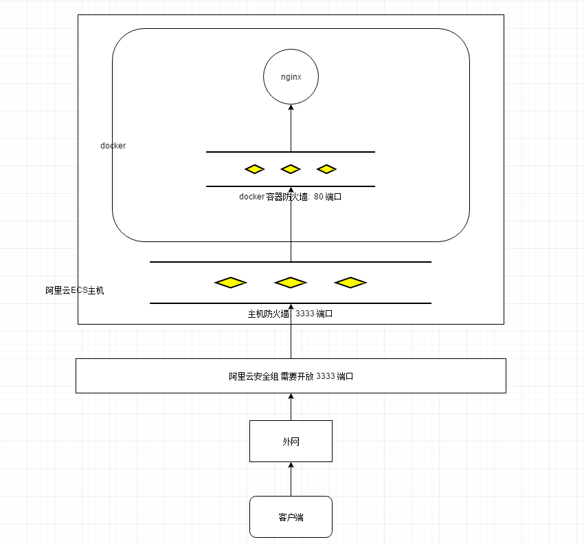

## docker 安装 docker

1. 搜索需要的镜像

https://hub.docker.com/_/nginx

2. 下载 `nginx`

```shell
sudo docker pull nginx
```

3. 运行 nginx 容器, 并且配置端口映射

```shell
sudo docker run -d --name ngx_1 -p 3333:80 nginx
# 说明:
# --name ngx_1  表示给这个容器起一个名字
# -d 表示后台守护进程运行
# -p 3333:80  表示将主机的 3333 端口映射到容器的 80 端口
```

4. 查看容器运行信息

```shell
sudo docker ps
# 输出如下:
CONTAINER ID        IMAGE               COMMAND                  CREATED
d4de47d8d49e        nginx               "/docker-entrypoint.…"   10 minutes ago

STATUS              PORTS                  NAMES
Up 10 minutes       0.0.0.0:3333->80/tcp   ngx_1
```

4. 进入容器, 查看 nginx 的配置文件

```shell
# 进入容器内部, 查看nginx的配置文案信息
sudo docker exec -it /bin/bash ngx_1

# 具体步骤如下:
# 1)进入容器内部
[root@localhost ~]# sudo docker exec -it ngx_1 /bin/bash

# 2)查找nginx配置
root@d4de47d8d49e:/# whereis nginx
nginx: /usr/sbin/nginx /usr/lib/nginx /etc/nginx /usr/share/nginx
root@d4de47d8d49e:/# cd /etc/nginx/
root@d4de47d8d49e:/etc/nginx# ls
conf.d	fastcgi_params	koi-utf  koi-win  mime.types  modules  nginx.conf  scgi_params	uwsgi_params  win-utf

# 3) 查看nginx配置文件内容
root@d4de47d8d49e:/etc/nginx# cat nginx.conf
user  nginx;
worker_processes  1;

error_log  /var/log/nginx/error.log warn;
pid        /var/run/nginx.pid;


events {
    worker_connections  1024;
}


http {
    include       /etc/nginx/mime.types;
    default_type  application/octet-stream;

    log_format  main  '$remote_addr - $remote_user [$time_local] "$request" '
                      '$status $body_bytes_sent "$http_referer" '
                      '"$http_user_agent" "$http_x_forwarded_for"';

    access_log  /var/log/nginx/access.log  main;

    sendfile        on;
    #tcp_nopush     on;

    keepalive_timeout  65;

    #gzip  on;

    include /etc/nginx/conf.d/*.conf;
}
```

5. 访问测试, 如果能够成功说明没有问题

```shell
# 本机
curl http://localhost:3333

# 外网
http://192.168.xxx.xxx:3333
```


