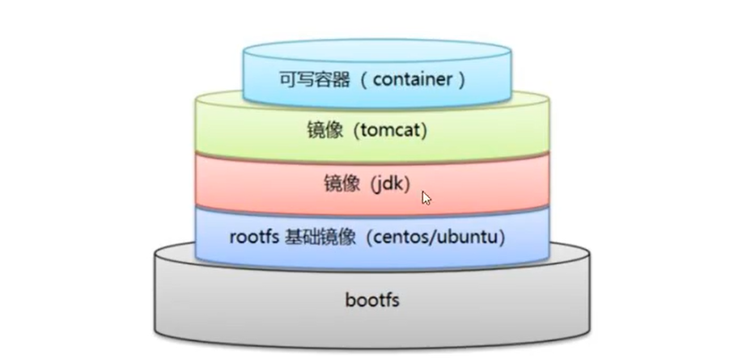
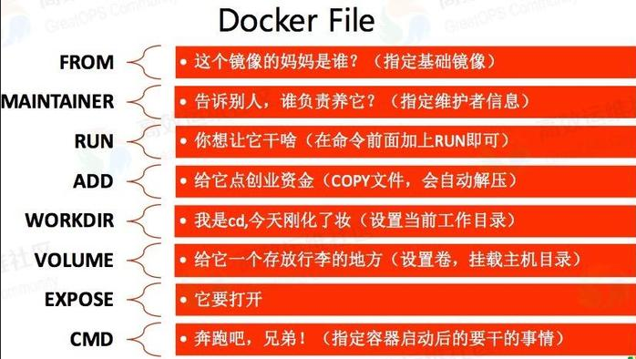
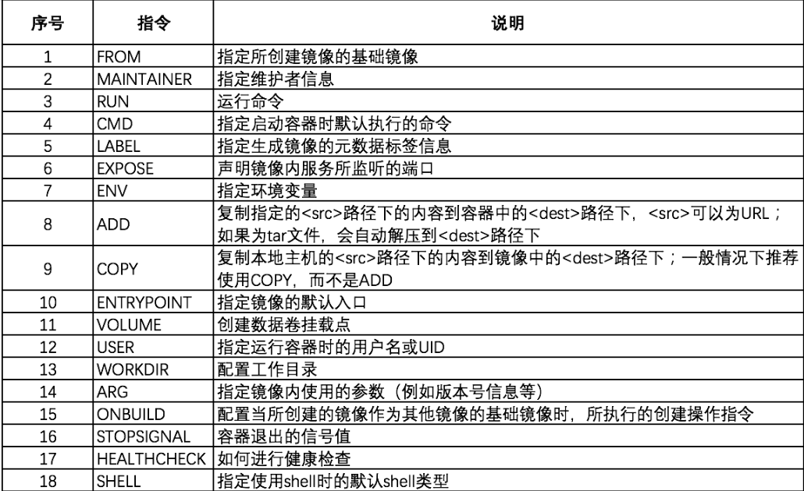

## Dockerfile

dockerfile 是一个用于构建 docker 镜像的脚本文件, 命令参数脚本

构建步骤:

1. 编写 dockerfile
2. docker build 构建镜像
3. docker run 运行镜像
4. docker push 发布镜像(dockerhub 阿里云镜像)


### Dockerfile 的构建

> 基础

1. 每个指令(保留关键字)都必须是大写
2. 脚本从上到下依次执行
3. `#` 表示注释
4. 每一个指令都会创建并提交一个新的镜像层, 并提交



dockerfile 是面向开发者的, 如果以后需要`发布项目`或者`搭建开发环境`,就需要编写docker镜像

步骤:

1. dockerfile: 构建文件, 定义了一切的步骤,源代码
2. docker image: 通过 dockerfile 构建生成的镜像, 最终发布和运行的产品
3. docker 容器 : 容器就是镜像运行起来后提供的服务


### dockerfile命令





> docker 命令

```shell
FROM           # 基础镜像,在哪个镜像上开始构建, 一般使用 centos 或者 ubuntu
MAINTAINER     # 维护者信息
RUN            # 构建镜像需要运行的命令
ADD            # 将文件复制到生成的镜像中
WORKDIR        # 镜像的工作目录
VOLUME         # 挂载目录
EXPOSE         # 指定容器向外暴露的端口
CMD            # 指定这个容器启动时,需要运行的命令(只有最后一个会生效)
COPY           # 将文件复制到镜像中
ENV            # 构建镜像时, 设置环境变量
```

> 实战练习: 使用 dockerfile 构建一个自己的 centos

```shell
# 指定基础镜像
FROM centos

# 维护者(作者)信息
MAINTAINER liaohui5<1182468610@qq.com>

# 添加环境变量, 设置工作目录
ENV MYPATH /usr/local
WORKDIR $MYPATH

# 安装软件
RUN yum install -y install vim
RUN yum install -y install net-tools

# 暴露容器端口
EXPOSE 80

# 执行一些命令
CMD echo "--- end ---"

# 进入容器
CMD /bin/bash
```

> 通过 dockerfile 构建镜像: docker build -f dockerfile路径  -t  镜像名:[tag]

```shell
sudo docker build -f dockerfile -t mycentos:1.0 
```


