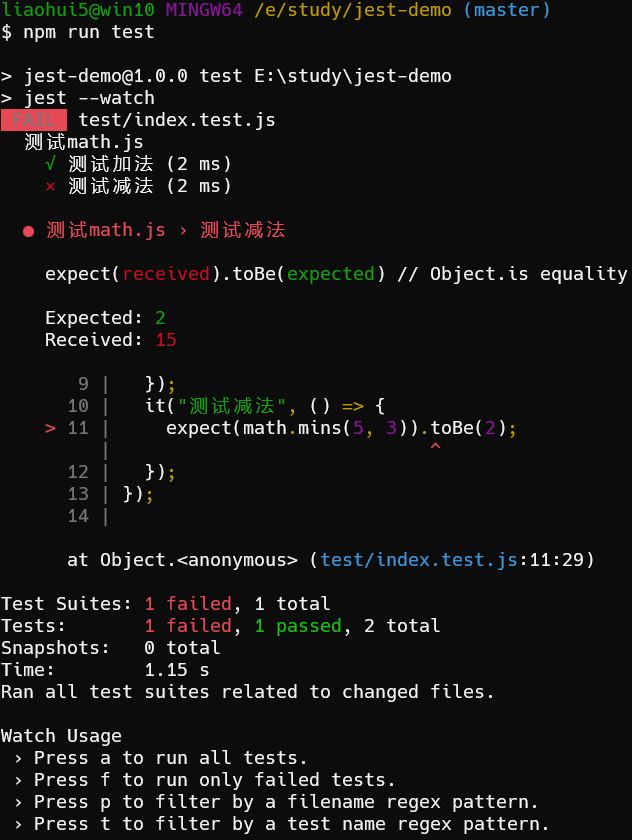
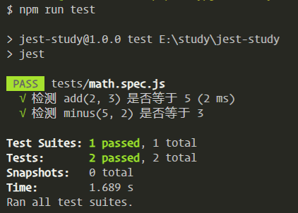

## Jest 基础

> jest官方文档

+ [jest官方文档](https://jestjs.io/docs/zh-Hans/getting-started)

> jest 的优点

+ API 简单易用
+ 功能健全
+ 基础好, 速度快
+ 隔离性好, 支持多项目运行
+ IDE 工具链支持好
+ 快速导出测试覆盖率

> 安装环境

```shell
npm i jest -D
```

```json
// 在 package.json 添加运行脚本
"scripts": {
    "test": "jest --watch" // npm run test
}
```

## 体验 jest 测试

> math.js

```js
module.exports = {
  // 加法
  add(a, b) {
    return a + b;
  },

  // 减法
  minus(a, b) {
    return a * b; // 故意写错, 然后用 jest 测试
  }
};
```

> test/math.test.js

```js
const math = require("../math.js");

// describe: 定义一个测试区块
describe("测试math.js", () => {
  // it: 定义一个测试单元
  it("测试加法", () => {
    // expect 断言, 判断执行的结果是否符合预期
    expect(math.add(2, 3)).toBe(5);
  });
  it("测试减法", () => {
    expect(math.minus(5, 3)).toBe(2);
  });
});
```

> 运行 npm run test 的结果

可以很直白的看出 `测试加法` 这个测试用例通过了, 但是 `测试减法` 这个测试用例没有通过,

`期望接收到一个2` `但是实际却收到了一个 15`




## 配置 bable 让 jest 支持 es6 模块

> 安装 babel 转换语法

```shell
npm i @babel/core @babel-preset-env  -D
```

> 修改 babel 默认配置 babel.config.js

```json
module.exports = {
  presets: [
    [
      // 配置 preset-env
      "@babel/preset-env",
      {
        targets: {
          node: "current",
        },
      },
    ],
  ],
};
```

> 使用 import 语法来测试

```js
// js/math.js
// 加
export function add(a, b) {
  return a + b;
}

// 减
export function minus(a, b) {
  return a - b;
}
```

```js
// tests/math.spec.js
import { add, minus, mutil, div } from "../js/math";

it("检测 add(2, 3) 是否等于 5", () => {
  expect(add(2, 3)).toBe(5);
});

it("检测 minus(5, 2) 是否等于 3", () => {
  expect(minus(5, 2)).toBe(3);
});
```



## Jest 命令行(运行测试的模式切换)

```shell
a: 重新运行所有测试用例
f: 只运行测试失败的测试用例(--watchAll)
o: 只测试当前修改的文件相关的测试用例(需要使用git监控文件变化)(--watch)
t: 过滤模式
q: 退出文件监控模式
```


