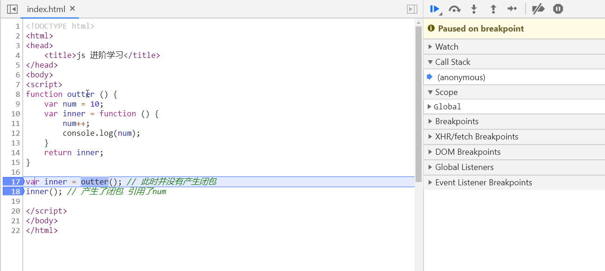
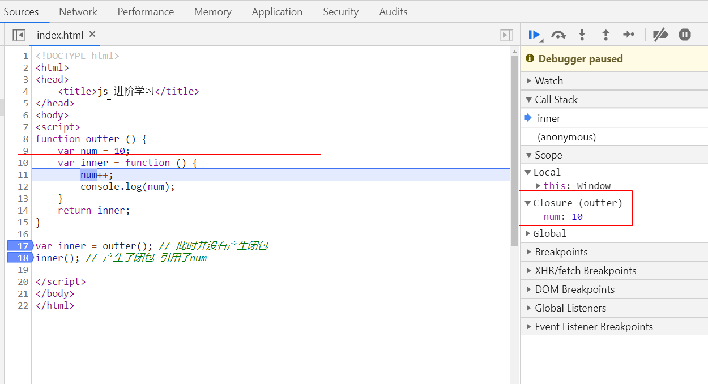

### 闭包的特性

[参考](https://juejin.im/entry/5aca253e5188255c5668b7bb)

- 封闭作用域
- 延长变量的生命周期(被引用的 num 没有被直接释放)
- 可用于封装模块(如: `AMD` `CMD` 规范)

### 闭包的产生

- 函数嵌套
- 内部函数引用外部函数的变量, 包含着引用变量的对象就叫闭包 `colsure`

```js
function outter() {
  var num = 10;
  var inner = function () {
    num++;
    console.log(num);
  };
  return inner;
}

var inner = outter(); // 此时并没有产生闭包
inner(); // 产生了闭包 引用了num
```





### 闭包的应用

- 将函数作为参数传递给其他函数来调用

```js
/**
 * 遍历对象|数组
 * @param  {Object} obj       对象或者数组
 * @param  {Function} handler 处理函数
 */
function each(obj, handler) {
  if (obj && typeof obj === "object" && typeof handler === "function") {
    for (let key of obj) {
      handler(key, obj[key], obj);
    }
  }
  throw new Error("exception info...");
}

let obj = {
  id: 1001,
  name: "testName",
};
let arr = ["hello", "world"];

each(obj, (key, val, obj) => {
  // ...
});

each(arr, (key, val, arr) => {
  // ...
});
```

- 封装模块

```js
// jQuery
(function(window) => {
    window.$ = function jQuery(selector, context) {
        // ...
    };
})(window);

// node.js
(function(exports, require, module, __filename, __dirname) {
    // Module code
});
```

### 闭包带来的问题

由于闭包会延长变量的生命周期, 导致变量不能及时被垃圾回收机制当做垃圾回收, 从而导致 `内存泄漏`

当内存泄漏多了, 就可能会导致 `内存溢出`

- 内存泄漏

> 内存泄漏: 不再需要的内存空间一直被占用, 没有及时释放, 导致内存的浪费

- 内存溢出

> 程序运行需要的内存过大, 超出硬件提供的最大内存

### JS 中常见的内存泄漏

1. 占用内存特别大的全局变量
2. 没有及时清理的 定时器 / 超时器
3. 闭包
