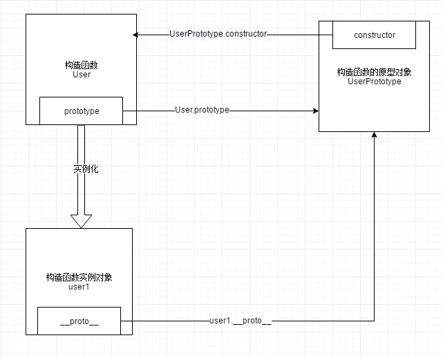
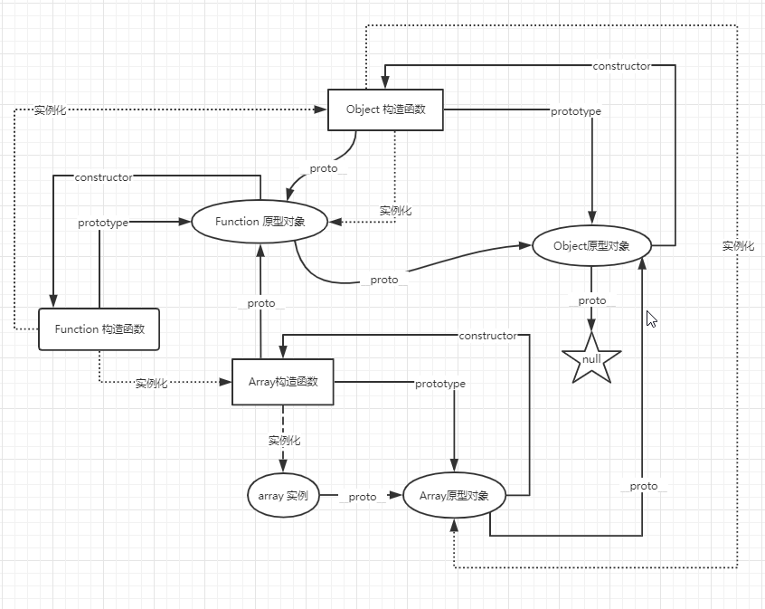
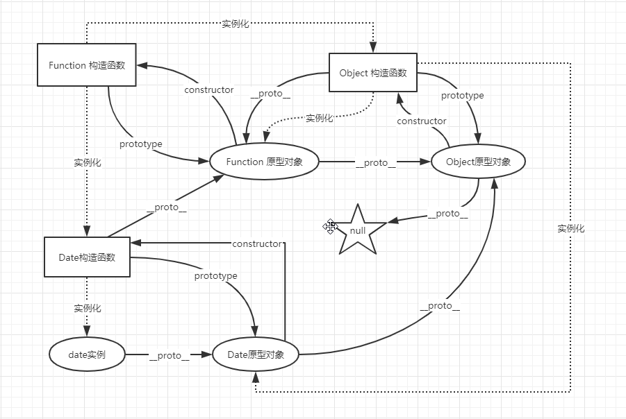

## 原型链

### 显式原型与隐式原型

- `prototype` : 显式原型
- `__proto__` : 隐式原型(非标准属性)

- 所有函数都有 `prototype` 属性, 这个属性是一个对象
- 构造函数(比如: User)的 `prototype` 对象默认有一个 `constructor` 属性, 这个 `constructor` 属性指向 `prototype` 属性所在的构造函数(User)
- 通过 `new` 构造函数的到的实例对象(比如: u1)都有一个 `__proto__` 属性, 这个属性是一个对象, 实例对象(u1)的 `__proto__` 属性指向构造函数(User)的 `prototype` 属性




```js
// User: 构造函数
function User() {
  // code...
}

// u1: 实例对象
let u1 = new User();
console.log(User.prototype === u1.__proto__); // true
console.log(User.prototype.constructor === User); // true
```

### JS 数组的原型链



### JS Date 的原型链



### JS 对象原型链检索规则

1. 一个对象调用属性时, 首先自身查找对应的属性
2. 如果自身有对应的属性, 则返回该该属性对应的值
3. 如果自身没有对应得属性, 则向上级原型对象中查找,
4. 如果原型对象中有, 则返回对应属性的值
5. 如果没有再依次向上级查找, 找到就立即返回对应属性的值
6. 如果到原型链的末端都没有找到就返回 `undefined`

```js
// ---- 实例代码1 -----
function Person(name) {
  this.name = name;
}
Person.prototype.age = 10;
let p1 = new Person("tom");
console.log(p1.name); // tom: 自身的name属性
console.log(p1.age); // 10:  原型链上的 age 属性
console.log(p1.toString()); // [object Object]: 依次向上查找, 最终找到了Object的 toString() 方法
console.log(p1.sex); // undefined: 原型链上没有这个属性

// ---- 实例代码2 -----
function One() {}

function Two() {}
Two.prototype.toString = function () {
  return "Two 原型上的 toString 方法";
};

function Three() {
  this.toString = function () {
    return "Three 实例对象上的 toString 方法";
  };
}
Three.prototype.toString = function () {
  return "Three 原型上的 toString 方法";
};

let obj1 = new One();
let obj2 = new Two();
let obj3 = new Three();
console.log(obj1.toString()); // [object Object]: 这是Object上的toString方法
console.log(obj2.toString()); // Two 原型上的 toString 方法
console.log(obj3.toString()); // Three 实例对象上的 toString 方法
```

> 综上所述, 总结一句话就是: JS 对象原型链检索规则是 `就近原则`

- 谁(对象)调用的函数, this 就指向谁
- 全局代码默认情况下: this 指向 window
- 箭头函数没有自己的 this, 箭头函数的 this 是上下文对象

## bind, call 和 apply

> this 指向问题

- 默认情况下, 谁(对象)调用的函数, this 就指向谁
- 全局代码默认情况下: this 指向 window
- 箭头函数没有自己的 this, 箭头函数的 this 是上下文对象

> 作用

强行 `改变 this 的指向`, 可以让 es5 拥有继承的功能

> 应用实例

```js
//  判断是否是数组, 用 typeof 是无法判断的
Object.prototype.toString.call(new Array()); // [object Array]

// 获取数组中最大值, 最小值(不用 sort)
const arr = [3, 4, 5, 2, 1];
console.info("max:", Math.max.apply(arr, arr));
console.info("min:", Math.min.apply(arr, arr));
```

> 区别

- bind: 改变 this, 并且返回一个新的函数, 可以传 n 个参数
- call: 改变 this, 然后立即调用函数, 可以传 n 个参数
- apply: 改变 this, 然后立即调用函数, 只能传两个参数第一个是改变 this 指向, 第二个是参数数组

```js
function showThis(...args) {
  console.info(this);
  console.info(args);
}

const obj = { name: "object" };

const showThis2 = showThis.bind(obj, 1, 2, 3);
showThis2(); // {name:"object"} [1, 2, 3]

showThis.call(obj, 4, 5, 6); //  {name:"object"} [4, 5, 6]

showThis.apply(obj, [6, 7, 8]); //  {name:"object"} [6, 7, 8]

// apply 第二个参数必须是数组
// apply 会将这个数组一次传入调用的函数 showThis(6,7,8)
// 我这里是一个数组, 只是因为我用了 ...args 解构了
```

## 原型链实现继承功能

```js
// 人类
function Person(name, age) {
  this.name = name;
  this.age = age;
  this.eat = function () {
    console.log("--- 人需要吃饭 ---");
  };
}

// 学生类
Student.prototype = new Person();
Student.prototype.constructor = Student;

function Student(name, age, studentId) {
  Person.call(this);
  this.name = name;
  this.age = age;
  this.studentId = studentId;
  this.say = function () {
    console.info("我的名字是:", this.name);
    console.info("我的年龄是:", this.age);
    console.info("我的学号是:", this.studentId);
  };
}

const zs = new Student("张三", 16, "2020111101");
zs.eat();
zs.say();

// --- 人需要吃饭 ---
// 我的名字是: 张三
// 我的年龄是: 16
// 我的学号是: 2020111101
```

## es6 继承

```js
class Person {
  constructor(name, age) {
    this.name = name;
    this.age = age;
  }
  eat() {
    console.info("--- 人需要吃饭 ---");
  }
}

class Student extends Person {
  constructor(name, age, studentId) {
    super(name, age);
    this.studentId = studentId;
  }

  say() {
    console.info("我的名字是:", this.name);
    console.info("我的年龄是:", this.age);
    console.info("我的学号是:", this.studentId);
  }
}

const zs = new Student("张三", 16, "2020111101");
zs.eat();
zs.say();
```

## es5 继承和 es6 继承的区别

> 执行顺序不同

- es5 继承: 先创建子类的实例对象, 然后再将父类的方法添加到子类的实例对象上 `Parent.call(this)`，然后再把原型链继承 `Child.prototype = Object.create(Parent.prototype)`

- es6 继承: 先创建父类的实例对象, 赋值给 this(所以在子类的构造函数中必须先调用父类的 super() 方法，才可使用 this 关键字，否则报错), 然后再用子类的构造函数修改 this 实现继承

> 语法的不同

- es5: `function` `call`
- es6: `extends` `super`

* es5 实现继承:

```js
function Parent() {}
Parent.prototype.say = function () {
  console.info("Parent:父类方法");
};
function Child() {
  // 1. 先创建的子类: 因为 Parent.call(this) 已经能使用 this 了
  // 证明子类的实例对象已经创建好了, 否则是无法使用 this 的
  Parent.call(this);
}

Child.prototype = Object.create(Parent.prototype);
Child.prototype.constructor = Child;
const child = new Child();
console.info(child); // {}
child.say(); // Parent:父类方法
```

- es6 实现继承:

```js
class Es6Parent {
  say() {
    console.info("Es6Parent: 父类方法");
  }
}

class Es6Child extends Es6Parent {
  // 必须要先调用 super 方法才能使用 this, 否则报错
  // 证明是先创建的父类实例赋值给 this,
  // 然后使用子类的构造函数修改 this
  constructor() {
    // console.info(this); // 报错
    super();
  }
}
const es6Child = new Es6Child();
console.info(es6Child); // {}
es6Child.say(); // Es6Parent: 父类方法
```
