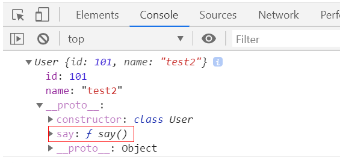

## 类和对象概念理解

> 类和对象的定义

- 类: 对一类事物的抽象描述(比如: 人类)
- 对象: 对一个事物的具体描述(比如: 张三)

> 类和对象的关系

这个好理解, 如:
张三和人类的关系: `张三` 是一个 `人`, 张三是指一个具体的实际例子, 而 `人` 是一个抽象的描述

## 类

### 内置类

内置类 是 `JavaScript` 这个语言, 自带的类, 可以直接使用的类

- [Array](https://developer.mozilla.org/zh-CN/docs/Web/JavaScript/Reference/Global_Objects/Array)
- [Object](https://developer.mozilla.org/zh-CN/docs/Web/JavaScript/Reference/Global_Objects/Object)
- [Date](https://developer.mozilla.org/zh-CN/docs/Web/JavaScript/Reference/Global_Objects/Date)
- [更多](http://localhost:3000/#/js/base/docs)

### 创建自定义类

> es5 语法:

```js
function Person(options) {
  this.name = options.name || "";
  this.age = options.age || 0;
}

const p1 = new Person({ name: "张三", age: 20 });

console.log(p1);
```

> es6 语法(推荐):

```js
class Person {
  constructor(options) {
    this.name = options.name || "";
    this.age = options.age || 0;
  }
}

const p1 = new Person({ name: "张三", age: 20 });
console.log(p1);
```

## 对象

### 对象的组成

- 属性
- 方法

```js
var obj = {
  name: "object",
  run: function () {
    console.log("run");
  },
};
```

### 内置对象(不同平台内置不相同)

- [window](https://developer.mozilla.org/zh-CN/docs/Web/API/Window)
- [document](https://developer.mozilla.org/zh-CN/docs/Web/API/Document)
- [history](https://developer.mozilla.org/zh-CN/docs/Web/API/History)
- [更多](https://developer.mozilla.org/zh-CN/docs/Web/API/Window)
- [node.js 内置对象](http://api.nodejs.cn)

### 创建自定义对象

- 直接创建

```js
let user = {
  id: 1001,
  name: "test",
  run: function () {
    console.log("run");
  },
};
```

- new Object

```js
let user = new Object();
user.id = 1001;
user.name = "test";
user.run = function () {
  console.log("run");
};
```

- 自定义类创建

```js
// es5
// function User(id, name) {
//   this.id = id;
//   this.name = name;
//   this.run = function () {
//     console.log("run");
//   };
// }
// let user = new User(100, "test1");

// es6(推荐)
class User {
  constructor(id, name) {
    this.id = id;
    this.name = name;
  }

  run() {
    console.log("run");
  }
}

let user = new User(101, "test2");
```

### 对象属性/方法的划分

- 静态属性/方法: 属于类, 所有生成的对象的属性/方法都一样
- 实例属性/方法: 属于对象, 各个对象的属性 相互独立

```js
// function User(id, name) {
//     this.id = id;
//     this.name = name;
//     this.say = function() {
//         console.log("say");
//     }
// }
// User.prototype.fingers = 2;
// User.prototype.run = function() {
//     console.log("run");
// }

class User {
  static fingers = 10; // 手指数
  constructor(id, name) {
    this.id = id;
    this.name = name;
  }

  static run() {
    console.log("run");
  }

  say() {
    console.log("say");
  }
}

let user = new User(101, "test2");
console.log(user);
```



由上图可以看到, 打印的这个对象没有 `run` 方法, 也没有 `fingers` 这个属性

### 对象类型判断

> 使用 `Object.prototype.toString.call`

- 这种方式只能判断内置对象的类型, 无法判断自定义对象的类型

```js
console.info(Object.prototype.toString.call(new Date())); // [object Date]
console.info(Object.prototype.toString.call(window)); // [object Window]
console.info(Object.prototype.toString.call(history)); // [object History]
console.info(Object.prototype.toString.call(navigator)); // [object Navigator]
console.info(Object.prototype.toString.call(Math)); // [object Math]

function Person(name) {
  this.name = name;
}
const p = new Person("zs");
console.info(Object.prototype.toString.call(p)); // [object Object]
```

> instanceof 关键字

```js
console.info([] instanceof Array); // true

const d = new Date();
console.info(d instanceof Date); // true

function Person(name) {
  this.name = name;
}
const p = new Person("zs");
console.info(p instanceof Person); // true
```
