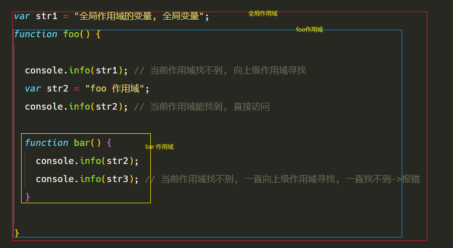

## 什么是作用域

任何语言都有作用域的概念, 但是 JavaScript 的比较特殊, 简单来说就是 `可访问的变量范围`
作用域就是一个独立的地盘，让变量不会外泄、暴露出去,
作用域最大的用处就是隔离变量，不同作用域下同名变量不会有冲突。

> 全局变量: 全局作用域

- 在任意位置都可以使用的变量, 一般都会挂载到 window 对象上

```js
var str = "hello world";

function log() {
  console.log(str);
}

log(); // hello world
console.log(window.str); // hello world
```

> 局部变量: 局部作用域

- 只能在指定范围范围内使用的变量, 比如某个函数中

```js
function log() {
  var str = "hello";
  console.log(str); // 在这个函数内容可以使用
}
log(); // hello
console.log(str); // Uncaught ReferenceError: str is not defined
```

## 作用域链

- 作用域是分层的，内层作用域可以访问外层作用域的变量, 如果一个变量在当前作用域未找到, 就会一层一层向外寻找, 知道找到为止, 如果在全局作用域下还未找到就报错
- 作用域只能由内向外寻找, 从外向里找



## 作用域提升

> 预解析


