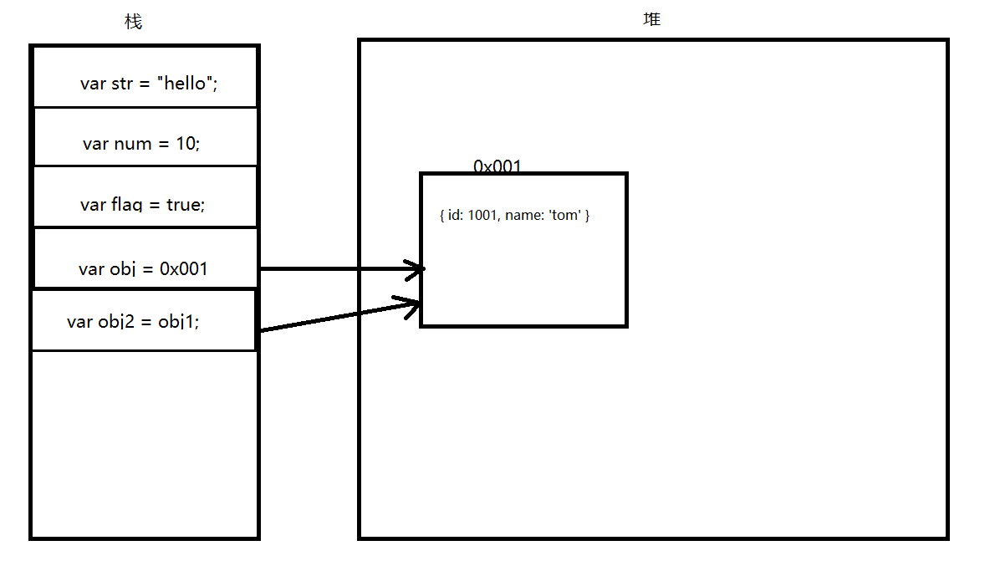

## JavaScript 数据结构分类

> 基本数据类型

- String
- Number
- Boolean
- null
- undefined
- Symbol

> 引用数据类型

- Object
  - Array
  - Function
  - Date
  - ...

## 内存结构-堆栈

- 栈: 操作速度快, 存储数据量小
- 堆: 操作速度相对慢, 存储数据量大
- `基本类型变量的值` 都存在栈区, `引用类型变量的引用地址存在栈区` 但是真实的值存在堆区



## 深度复制

> 深度复制: 指复制一个引用类型变量的值

因为, 引用类型变量栈区保存的是堆区的地址, 而不是真实的值, 当有的时候想复制一个引用类型的变量的时候
不能直接使用赋值语句, 因为使用赋值语句, 赋值的还是堆区的地址, 而不是真实的值

```js
const num1 = 10;
const num2 = num1; // 基本类型可以这样赋值

const obj = { id: 1001, name: "Jerry" };
const obj2 = obj; // 这样赋值是没有作用的, obj2 如果修改了, obj 的值也会被修改
obj2.name = "Tom";
console.log(obj.name === obj2.name); // true, 证明修改的是同一个堆内存中的数据
```

### 类型转换法

- 先将引用类型转换为基本类型, 然后在赋值

- 缺点: `JSON.stringify` 会忽略 `Function` 类型的数据, 如果数据较大, 会比较消耗内存

```js
const obj1 = { id: 1001, name: "Jerry" };
const obj2 = JSON.parse(JSON.stringify(obj1));
// JSON.stringify 将对象转字符串, 字符串是基本数据类型, 所以是直接复值, 而不是一个堆区的地址
// JSON.parse 将字符串转对象

obj2.name = "Tom";
console.log(obj1.name === obj2.name); // false, 证明修改的是同一个堆内存中的数据
```

### 深度遍历法

- 缺点: 虽然能复制 `Function` 类型的值, 但是由于是递归, 所以会很消耗性能

```js
function deepCopy(copys, target = {}) {
  const isObject = (target) => target instanceof Object;
  if (!(isObject(target) && isObject(copys))) {
    throw new TypeError("the parameters is must be object");
  }

  // 如果要拷贝的对象是个空对象直接返回原对象
  if (!Object.keys(copys).length) {
    return target;
  }

  let val;
  for (let key in copys) {
    val = copys[key];
    if (!isObject(val)) {
      target[key] = val;
      continue;
    }

    // 创建对应类型的临时对象, 然后拷贝对象中的属性然后赋值
    const temp = new copys.constructor();
    deepCopy(temp, val);
    target[key] = temp;
  }
  return target;
}

let o1 = {
  name: "jason",
  age: 10,
};
let o2 = {
  sex: 1,
  friends: ["alex", "jerry"],
  pet: {
    type: "cat",
    name: "tom",
  },
  birthday: new Date(),
};
o1 = deepCopy(o1, o2);
console.log(o1);
console.log(o2);
```
