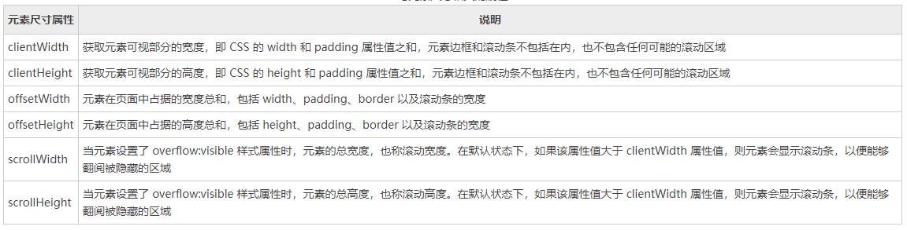

### js client 属性

- 元素可见的高度: document.body.clientHeight
- 元素可见的宽度: document.body.clientWidth
- 了解: _clientTop_ 和 _clientLeft_

### js Offset 属性

- 元素可见的高度(包括边框内边距): offsetHeight
- 元素可见的宽度(包括边框内边距): offsetWidth

> offsetWidth 和 style.width (高度同理)的区别:
>
> offsetWidth 会获取: 元素本身的高度 + padding + border
>
> style.width 会获取: 元素本身的高度 并且 style.width 只能获取行内样式
>
> offsetWidth 返回 `数字` style.width 返回 `带单位的字符串`

- 元素离父标签的顶部距离(带有定位的): offsetTop
- 元素离父标签的左边距离(带有定位的 ): offsetLeft
- 元素父标签(有定位的): offsetParent

> offsetParent 和 parentNode 的区别:
>
> offsetParent 会找到有定位的父标签(就近原则), parentNode 只能做到本元素的父标签

```js
// offset系列属性 和 style.属性 的区别:  以 offsetLeft 和style.left为例
// 1) style.left只能获取行内的,而offsetLeft可以获取所有的
// 2) offsetLeft可返回没有定位盒子距离左侧的距离为style.left只能返回有定位盒子的left
// 3) offsetLfet返回的数字而 style.left 返回的是字符串,除了数字还有单位的px
// 4) offsetLeft只能获取不能修改 style.left可以获取,也也可以修改
```

### js scroll 属性和方法

- 网页正文的高度: document.body.srcollHeight

- 网页正文的宽度: document.body.srcollWidth

- 网页滚动的高(最最常用): srcollTop

- 网页滚动的宽(左): srcollLeft
- 方法: 滚动到指定的位置: scrollTo(x,y)

> 注: 只有在窗口 或 文档的时候才能获取 scroll 属性的值

### 三大属性的区别

- width 和 height

```html
<!DOCTYPE html>
<html lang="en">
  <head>
    <meta charset="UTF-8" />
    <meta
      name="viewport"
      content="width=device-width, user-scalable=no, initial-scale=1.0, maximum-scale=1.0, minimum-scale=1.0"
    />
    <meta http-equiv="X-UA-Compatible" content="ie=edge" />
    <title>缓动动画</title>
    <style>
      * {
        margin: 0;
        padding: 0;
      }
      #box {
        width: 200px;
        height: 200px;
        background: #000;
        padding: 10px;
        border: 20px solid #ff0000;
      }
    </style>
  </head>
  <body>
    <div id="box" style="width: 200px"></div>
    <script>
      window.onload = function () {
        var box = document.getElementById("box");
        /**
         * width   : 元素本身的宽度
         * padding : padiung宽度
         * border  : border的宽度
         */
        // clientWidth = width + padding
        console.log(box.clientWidth, box.clientHeight);
        // offsetWidth = width + padding + border
        console.log(box.offsetWidth, box.offsetHeight);
        // offsetWidth = 能够滚动的宽度/高度,不能滚动时是 width + padding
        console.log(box.scrollWidth, box.scrollHeight);
      };
    </script>
  </body>
</html>
```

- top 和 left

```html
<!DOCTYPE html>
<html lang="en">
  <head>
    <meta charset="UTF-8" />
    <meta
      name="viewport"
      content="width=device-width, user-scalable=no, initial-scale=1.0, maximum-scale=1.0, minimum-scale=1.0"
    />
    <meta http-equiv="X-UA-Compatible" content="ie=edge" />
    <title>缓动动画</title>
    <style>
      * {
        margin: 0;
        padding: 0;
      }
      #box {
        width: 200px;
        height: 200px;
        background: #000;
        padding: 10px;
        border: 20px solid #ff0000;
      }
    </style>
  </head>
  <body>
    <div id="box" style="width: 200px"></div>
    <script>
      window.onload = function () {
        var box = document.getElementById("box");

        // 当前元素距离父元素(有定位的)左/上边的距离
        console.log(box.clientTop, box.clientLeft);
        // 当前元素左/上边边框的宽度
        console.log(box.offsetTop, box.offsetLeft);
        // 网页上/左边滚动的长度
        console.log(box.scrollTop, box.scrollLeft);
      };
    </script>
  </body>
</html>
```

---

### 处理 scroll 系列属性的浏览器兼容问题

- IE9+ 和 其他最新的浏览器

```javascript
window.pageXOffset; // scrollLeft
window.pageYOffset; // scrollTop
```

- Firefox 和 其他浏览器

```javascript
document.documentElement.scrollTop; // scrollTop
document.documentElement.scrollLeft; // scrollLeft
```

- Chrome 和 没有 DTD 的

```javascript
document.body.scrollTop; // scrollTop
document.body.scrollLeft; // scrollLeft
```

- 兼容所有浏览器的写法

```javascript
var scrollTop = window.pageYOffset || document.documentElement.scrollTop || document.body.scrollTop || 0; // scrollTop

var scrollLeft = window.pageYOffset || document.documentElement.scrollLeft || document.body.scrollLeft || 0; // scrollLeft

/**
 * 获取滚动的头部距离和左边距离
 * scroll().top
 * scroll().left
 * @returns {{top: number, left: number}}
 */
function scroll() {
  if (window.pageYOffset !== null) {
    return {
      top: pageYOffset,
      left: pageXOffset,
    };
  } else if (document.compatModel === "CSS1Compat") {
    // CSS1Compat w3c标准
    return {
      top: document.documentElement.scrollTop,
      left: document.documentElement.scrollLeft,
    };
  } else {
    return {
      top: document.body.scrollTop,
      left: document.body.scrollLeft,
    };
  }
}
```

---

## 处理获取屏幕可视区域宽高度兼容性问题

- IE9 及以上版本, 最新浏览器

```javascript
window.innerWidth; // 可视区域的宽度
window.innerHeight; // 可视区域的高度
```

- 标准模式浏览器

```javascript
document.documentElement.clientWidth; // 可视区域的宽度
document.documentElement.clientheight; // 可视区域的高度
```

- 其他

```javascript
document.body.clientWidth; // 可视区域的宽度
document.body.clientheight; // 可视区域的高度
```

- 兼容所有浏览器的写法

```javascript
/**
 * 获取屏幕的宽度和高度
 * client().width
 * client().height
 * @returns {{width: number, height: number}}
 */
function client() {
  if (window.innerWidth) {
    // IE9及以上版本浏览器
    return {
      width: window.innerWidth,
      height: window.innerHeight,
    };
  } else if (document.compatModel === "CSS1Compat") {
    // CSS1Compat w3c标准
    return {
      width: document.documentElement.clientWidth,
      height: document.documentElement.clientHeight,
    };
  }
  return {
    width: document.documentElement.clientWidth,
    height: document.documentElement.clientHeight,
  };
}
```



+ 参考: [http://c.biancheng.net/view/6028.html](http://c.biancheng.net/view/6028.html)
+ 参考: [https://www.cnblogs.com/echolun/p/10683679.html](https://www.cnblogs.com/echolun/p/10683679.html)
