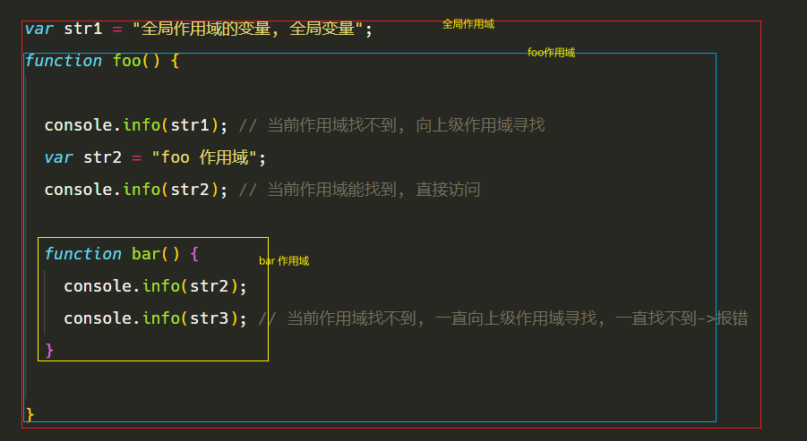

## 什么是作用域

- [参考文章](https://www.jianshu.com/p/c73f5124d69f)

任何语言都有作用域的概念, 但是 JavaScript 的比较特殊, 简单来说就是 `可访问的变量范围`
作用域就是一个独立的地盘，让变量不会外泄、暴露出去,
作用域最大的用处就是隔离变量，不同作用域下同名变量不会有冲突。

> 全局变量: 全局作用域

- 在任意位置都可以使用的变量, 一般都会挂载到 window 对象上

```js
var str = "hello world";

function log() {
  console.log(str);
}

log(); // hello world
console.log(window.str); // hello world
```

> 局部变量: 局部作用域

- 只能在指定范围范围内使用的变量, 比如某个函数中

```js
function log() {
  var str = "hello";
  console.log(str); // 在这个函数内容可以使用
}
log(); // hello
console.log(str); // Uncaught ReferenceError: str is not defined
```

## 作用域链

- 作用域是分层的，内层作用域可以访问外层作用域的变量, 如果一个变量在当前作用域未找到, 就会一层一层向外寻找, 知道找到为止, 如果在全局作用域下还未找到就报错
- 作用域只能由内向外寻找, 从外向里找



## 变量提升/函数提升

> 预解析

由于 JavaScript 是弱类型定义语言, 所以在代码执行之前, 会检查是否有语法错误, 将函数加载到内存中等等操作, 变量提升等等操作就称之为预解析

> 变量的声明方式

- es5: `var`
- es6: `var` `let` `const`

#### 变量提升

```js
console.log(str); // Uncaught ReferenceError: str is not defined
console.log(str1); // undefined
console.log(str2); // Uncaught ReferenceError: Cannot access 'str' before initialization
console.log(str3); // Uncaught ReferenceError: Cannot access 'str' before initialization

var str1 = "var";
let str2 = "let";
const str3 = "const";
```

上面的代码可以证明, 只有使用 `var` 关键字定义的变量才会有变量提升, 所以由此可见以上代码的执行顺序是这样的

1. `var str1=undefined` (预解析阶段)
2. `console.log(str);`
3. `console.log(str1);`
4. `console.log(str2);`
5. `console.log(str3);`
6. `str1 = "var";` (代码执行阶段)
7. `let str2 = "let";`
8. `const str3 = "const";`

#### 函数提升

定义函数的方式有:

- 使用 `function` 关键字
- 直接给变量赋值一个函数 `let fn = () => console.log("fn")`

```js
fn1(); // fn1
console.info("fn2 is:", fn2); // undefined
fn3(); // Uncaught ReferenceError: Cannot access 'fn3' before initialization

function fn1() {
  console.info("fn1");
}

var fn2 = function () {
  console.info("fn2");
};

let fn3 = function () {
  console.info("fn3");
};
```

由以上代码可以得出: 只有使用 `function` 关键字声明的函数才会函数提升, 在预解析阶段提前加载到内存中, 使用变量赋值的方式, 并不会函数提升, 只会遵循 `变量提升` 的规则, 所以代码的执行顺序应该是:

> 预解析阶段

1. `var fn2 = undefined;`
2. `function fn1() {...}`

> 代码执行阶段

1. `fn1();`
2. `console.info("fn2 is:", fn2);`
3. `fn3();`
4. `fn2 = function () {...}`
5. `let fn3 = function () {...}`
