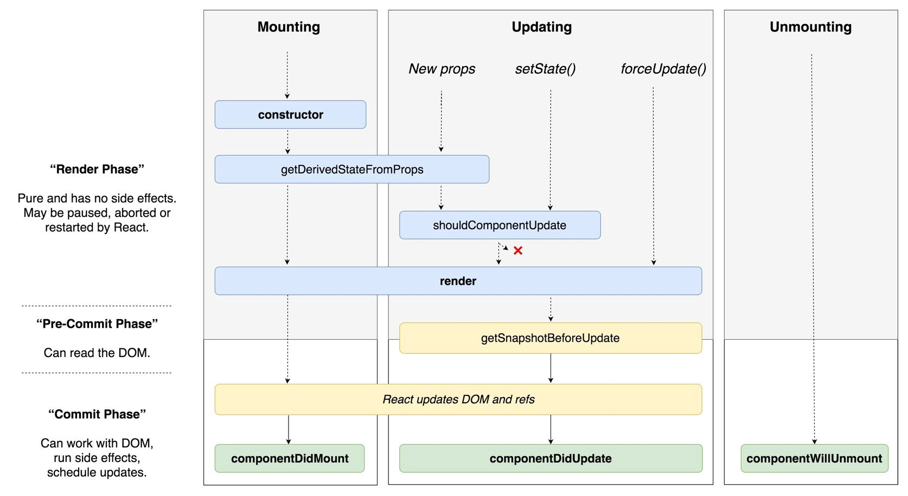

> react 的生命周期有很多, 但是有很多都不推荐使用, 因为后面的版本即将被移除, 所以只要知道以下几个就差不多了

- constructor() 实例化组件

- componentDidMount() 组件挂载后, 可获取 dom

- componentDidUpdate() 组件 state 改变后执行, 可获取最新的 state

- render() state 发生变化会重新渲染

- componentWillUnmount () 组件卸载前, 可移除一些事件监听

