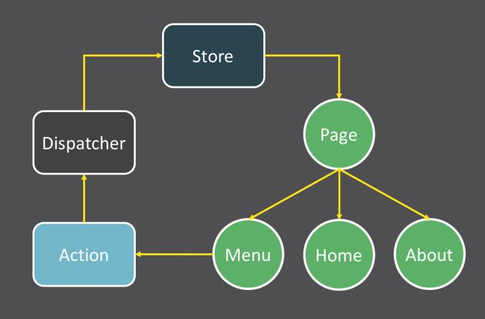
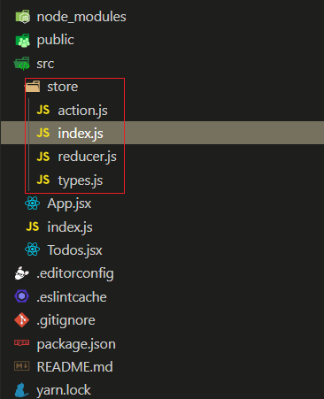
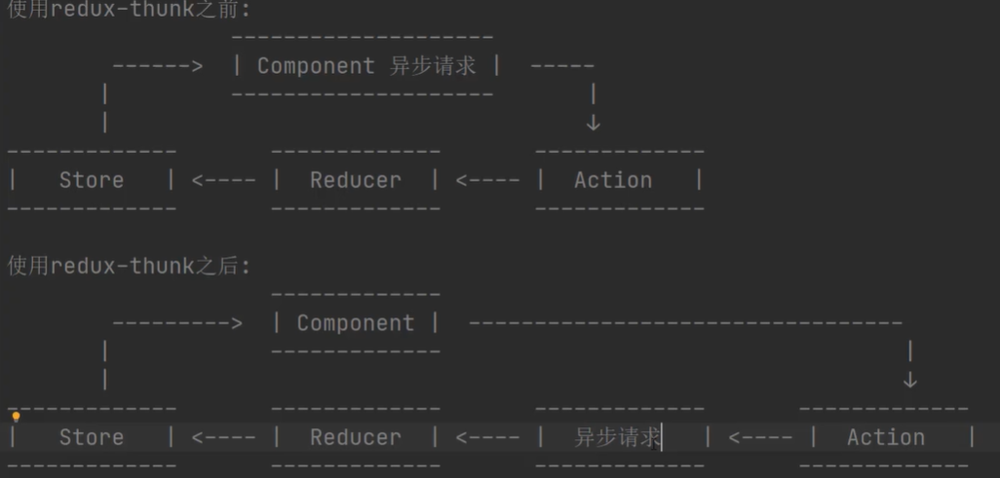

## 可预测的状态管理库 - redux

Redux 是 JavaScript 状态容器，提供可预测化的状态管理。[中文文档](https://www.redux.org.cn/)

### 什么是可预测的状态管理

数据在 `什么时候`, `因为什么`, 发生了 `什么改变`, 都是 `可以控制和最终的`, 我们就称之为 `可预测的状态管理`

### 为什么使用 redux?

1. React 是通过数据来驱动界面更新的, React 负责更新界面, 而我们只需要负责管理相应的数据(状态)
2. 随着页面越来越复杂, 我们需要在不同的组件中共享一些状态, 而且状态还可能存在依赖关系
3. 在程序相对复杂的时候, 想要很要很好的知道 `什么时候改变` `为什么改变` `改变了什么状态` 就需要用到 `redux`

### redux 三大核心

1. 通过 Store 来保存状态
2. 所有状态不能直接修改, 只能通过 action 来修改
3. 通过 reducer 将 store 和 action 串联起来



### redux 基本使用

```js
const redux = require("redux");

// 1.定义一个状态
const initState = {
  count: 0,
};

// 2.利用 store 来保存状态
const store = redux.createStore(reducer);

// 3.利用 action 修改状态
const incrmentAction = { type: "incrment", payload: { num: 1 } };
const decrmentAction = { type: "decrment", payload: { num: 1 } };

// 4.利用 reducer 串联 store 和 action
function reducer(state = initState, action) {
  const { type, payload } = action;
  const newState = {};
  newState.count = state.count;
  switch (type) {
    case "incrment": // +1
      newState.count += payload.num;
      break;
    case "decrment": // -1
      newState.count -= payload.num;
      break;
  }

  return newState;
}

// 5.监听 state 状态变化
store.subscribe(() => {
  // 获取 store 中的 state 状态
  console.info("state 发生变化了:", store.getState());
});

// 触发修改, 让 state 中的值发生变化
store.dispatch(incrmentAction);
```

### react-redux 和 redux 的关系

1. redux 是一个状态管理的库, 在任何 js 环境中都能使用
2. react-redux 是一个 `基于 redux 并且专为 react 设计的状态管理库`

## 在 react 中使用 react-redux

> 文档资料

- [英文官网](https://redux.js.org/introduction/getting-started)

#### 安装

```sh
yarn add redux react-redux
# or
npm i redux react-redux
```

#### 创建相关文件



#### 代码实现

> 组件部分

- src/index.js

```jsx
import React from "react";
import { render } from "react-dom";
import { Provider } from "react-redux";
import store from "./store/index";
import App from "./App.jsx";

render(
  <Provider store={store}>
    <App />
  </Provider>
  document.getElementById("root")
);
```

- src/app.jsx

```jsx
import React from "react";
import { connect } from "react-redux";
import { createTodoAction } from "./store/action";
import Todos from "./Todos";

class App extends React.Component {
  constructor(props) {
    super(props);
    this.todoRef = React.createRef();
  }

  render() {
    return (
      <div>
        <Todos />
        <div>
          <input ref={this.todoRef} type="text" />
          <button onClick={() => this.addTodo()}>添加任务</button>
        </div>
      </div>
    );
  }

  // 添加TODO
  addTodo() {
    const content = this.todoRef.current.value.trim();
    if (!content) {
      alert("任务内容不能为空");
      return;
    }

    const todos = this.props.todos || [];
    const isExists = todos.find((item) => item.content === content);
    if (isExists) {
      alert("任务已经存在");
      return;
    }

    const lastId = todos[todos.length - 1].id || 0;
    this.props.createTodo(lastId + 1, content);
    this.todoRef.current.value = "";
  }
}

// 将 store 中保存的 todos 映射到 props 上
// 也就是说, 在组件中可以直接使用 this.props.todos 就能
// 直接访问到 store 中保存的 todos
const mapStateToProps = (state) => {
  return {
    todos: state.todos,
  };
};

// 因为是直接返回一个对象: 有的人会利用 js 箭头函数的特性,
// 省略 retuen 语句, 但只写 {} 就无法识别, 所以必须 => ({})
// 使用 connect 将这个组件和react-redux连接起来后, 会
// 将这个 mapDispatchToProps 中返回对象上的所有方法
// 映射到组件的 props 上, 也就是说可以使用 this.props.createTodo
// 来调用这个方法
const mapDispatchToProps = (dispatch) => ({
  createTodo: (id, content) => dispatch(createTodoAction({ id, content })),
});

export default connect(mapStateToProps, mapDispatchToProps)(App);
```

- src/Todos.jsx

```jsx
import React from "react";
import { connect } from "react-redux";
import { removeTodoAction } from "./store/action";

class Todos extends React.PureComponent {
  render() {
    const todos = this.props.todos || [];
    return (
      <ul>
        {
          /* 直接遍历 props 中的 todos */
          todos.map((item) => {
            return (
              <li key={item.id}>
                <span>{item.content}</span>
                <button onClick={() => this.props.removeTodoById(item.id)}>
                  删除
                </button>
              </li>
            );
          })
        }
      </ul>
    );
  }
}

const mapStateToProps = (state) => ({
  todos: state.todos,
});

const mapDispatchToProps = (dispatch) => ({
  removeTodoById: (id) => dispatch(removeTodoAction(id)),
});

export default connect(mapStateToProps, mapDispatchToProps)(Todos);
```

> store 部分

- src/store/index.js

```js
import { createStore } from "redux";
import reducer from "./reducer.js";

const store = createStore(
  reducer,
  // 检查是否安装调试工具, 开启调试
  window.__REDUX_DEVTOOLS_EXTENSION__ && window.__REDUX_DEVTOOLS_EXTENSION__()
);

export default store;
```

- src/store/reducer.js

```js
import * as types from "./types";

const initState = {
  todos: [
    /*{ id: 101, content: "今天学习react-redux" }*/
  ],
};

const reducer = (state = initState, action) => {
  const { type, payload } = action;
  const newState = JSON.parse(JSON.stringify(state));
  switch (type) {
    case types.CREATE_TODO: // 增加 TODO
      newState.todos.push(payload);
      break;

    case types.REMOVE_TODO: // 删除 TODO
      newState.todos = newState.todos.filter((item) => item.id !== payload.id);
      break;

    default:
      console.info("未知的 Action Type!", type);
  }

  return newState;
};

export default reducer;
```

- src/store/types.js

```js
// 增加TODO
export const CREATE_TODO = "create_todo";

// 删除TODO
export const REMOVE_TODO = "remove_todo";
```

- src/store/action.js

```js
import * as types from "./types";

// 创建 todo
export const createTodoAction = (payload) => ({
  type: types.CREATE_TODO,
  payload,
});

// 删除 todo
export const removeTodoAction = (id) => ({
  type: types.REMOVE_TODO,
  payload: { id },
});
```

## react-redux 的实现原理

```js
import ReactDOM from "react-dom";
import React from "react";

const StoreCtx = React.createContext({});

export const Provider = StoreCtx.Provider;
export const connect = (mapStateToProps, mapDispatchToProps) => (Wrapper) => {
  class AdvComponent extends React.PureComponent {
    constructor(props, ctx) {
      super(props, ctx);
      this.state = {
        storeState: { ...mapStateToProps(this.context.getState()) },
      };
    }

    componentDidMount() {
      this.context.subscribe(() => {
        this.setState({
          storeState: { ...mapStateToProps(this.context.getState()) },
        });
      });
    }

    componentWillUnmount() {
      this.context.unsubscribe();
    }

    render() {
      return (
        <Wrapper
          {...this.props}
          {...mapStateToProps(this.context.getState())}
          {...mapDispatchToProps(this.context.dispatch)}
        />
      );
    }
  }

  AdvComponent.contextType = StoreCtx;
  return AdvComponent;
};
```

> 使用与官方 `react-redux` 不同的是:

```jsx
import React from "react";
import { render } from "react-dom";
import App from "./App.jsx";
import { Provider } from "./react-redux";
import store from "./store/index";

render(
  <React.StrictMode>
    {/* 注意: 此处用的是 value 而不是 store, 其他的和官方的 react-redux 使用没有什么不同 */}
    <Provider value={store}>
      <App />
    </Provider>
  </React.StrictMode>,
  document.getElementById("root")
);
```

## redux-thunk 中间件

> 什么是中间件, 为什么要使用中间件?

可以在 action 被派发到 reducer 之前做一些额外的操作, 这个操作的函数就叫中间件

使用中间件, 可以降低代码耦合性, 提高代码的可维护性



[redux-thunk github](https://github.com/reduxjs/redux-thunk/)

默认情况下, dispatch 方法只能接收一个对象, 如果想让 dispatch 除了可以接收对象以外还可以接收方法,
那么我们可以使用 redux-thunk 中间件 redux-thunk 中间件的作用: 可以让 dispatch 接收一个函数,
可以让我们在通过 dispatch 派发任务的时候去执行这个传递的函数

> 1.安装

```sh
yarn add redux-thunk
# or
npm  i redux-thunk
```

> 2.在 store 应用中间件 src/store/index.js

```js
import { createStore, applyMiddleware, compose } from "redux";
import reducer from "./reducer.js";
import ReduxThunk from "redux-thunk";

// 检测是否有浏览器调试插件
const composeEnhancers =
  typeof window === "object" && window.__REDUX_DEVTOOLS_EXTENSION_COMPOSE__
    ? window.__REDUX_DEVTOOLS_EXTENSION_COMPOSE__({})
    : compose;

// 应用中间件
const enhancer = composeEnhancers(applyMiddleware(ReduxThunk));

const store = createStore(reducer, enhancer);

export default store;
```

3. 使用

- src/App.jsx

```jsx
import React from "react";
import { connect } from "react-redux";
import { getRecomPlayListAction } from "./store/action";

class App extends React.Component {
  render() {
    return (
      <div>
        <div>
          <button onClick={() => this.props.getRecomPlayList()}>
            获取网易云音乐推荐歌单
          </button>
        </div>

        {/* 获取到的数据: */}
        <div>
          <pre>{JSON.stringify(this.props.recomPlayList, "", 4)}</pre>
        </div>
      </div>
    );
  }
}

const mapStateToProps = (state) => ({
  recomPlayList: state.recomPlayList,
});

const mapDispatchToProps = (dispatch) => ({
  getRecomPlayList: () => dispatch(getRecomPlayListAction),
});

export default connect(mapStateToProps, mapDispatchToProps)(App);
```

- src/store/action.js

```js
import * as types from "./types";

/**
 * 获取推荐歌单 action, 如果已经获取了, 就不获取了
 * @param {Function} dispatch 派发 action
 * @param {Function} getState 用于获取 store 中的 state
 */
export const getRecomPlayListAction = (dispatch, getState) => {
  const state = getState();
  if (state.recomPlayList.length) {
    return;
  }

  const url = "http://musicapi.liaohui5.cn/personalized?limit=10";
  fetch(url)
    .then((res) => res.json())
    .then((data) => {
      const action = {
        type: types.GET_RECOM_PLAY_LIST,
        payload: [],
      };

      if (data.code !== 200) {
        console.log("响应数据有误", data);
      } else {
        action.payload = data.result;
      }

      dispatch(action);
    })
    .catch((error) => {
      console.info("请求出错了...", error);
    });
};
```

- src/store/reducer.js

```js
import * as types from "./types";

const initState = {
  recomPlayList: [], // 推荐歌单
};

const reducer = (state = initState, action) => {
  const newState = { ...state };
  const { type, payload } = action;

  switch (type) {
    case types.GET_RECOM_PLAY_LIST: // 获取推荐歌单
      newState.recomPlayList = payload;
      break;

    default:
      console.info("未知的 Action Type!", type);
  }

  return newState;
};

export default reducer;
```

## 自定义 redux 中间件

- 定义中间件

```js
/**
 * 中间件的本质就是一个函数, 如果在 store 中应用,
 * 所有 action 在被 dispatch之前, 会先执行所有中间件,
 * 所有中间件执行完后再 dispatch 给 reducer 去处理
 *
 * @param {Object} store 包含两个方法, dispatch 和 getState
 * @param store.dispatch: 派发 action, 在本次 action 执行过程中派发其他的 action
 * @param store.getState: 获取当前 store 的所有状态
 */
let reduxLogger = (store) => {
  /**
   * @param {Function} next 如果本中间件执行完了, 需要调用这个方法去执行下一个中间件
   */
  return (next) => {
    /**
     * @param action 当前 action 信息
     */
    return (action) => {
      // 中间件的逻辑代码
    };
  };
};

// 这种写法是上面那种写法的简写形式, 上面那种写法只是为了写注释 ٩(๑>◡<๑)۶
reduxLogger = (store) => (next) => (action) => {
  console.log(`${action.type}执行前的 state:`, store.getState());
  next(action);
  console.log(`${action.type}执行后的 state:`, store.getState());
};

export default reduxLogger;
```

- 在 store 中应用中间件

```js
import { createStore, applyMiddleware } from "redux";
import reducer from "./reducer.js";
import ReduxThunk from "redux-thunk";
import ReduxLogger from "./reduxLogger";

const store = createStore(reducer, applyMiddleware(ReduxThunk, ReduxLogger));

export default store;
```

## redux 浏览器调试工具

[redux-devtools-extension](https://github.com/zalmoxisus/redux-devtools-extension)
