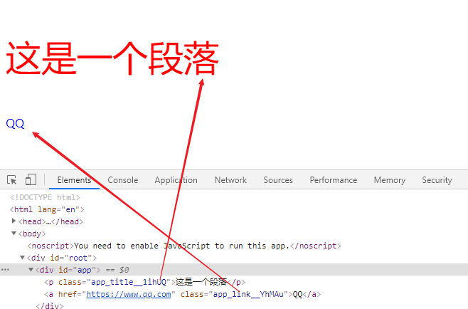

### 内联样式

- 优: 样式不会有冲突, 而且可以动态获取 state 中的值
- 缺: 所有属性都需要使用驼峰式写法, 编辑器没有提示, 样式多代码混乱, 无法编写特殊的样式(伪类)

```jsx
import React from "react";

class App extends React.PureComponent {
  state = {
    fontSize: "50px",
  };
  render() {
    const { fontSize } = this.state;
    return (
      <div id="app">
        <p style={{ fontSize, color: "red" }}>这是一个段落</p>
      </div>
    );
  }
}

export default App;
```

### 外链样式

- 优: 支持所有 css 语法, 代码提示
- 缺: 污染全局类名, 因为默认是全局导入

```css
/* src/app.css */
.paragraph {
  font-size: 50px;
  color: red;
}
```

```jsx
// src/App.jsx

import React from "react";
import "./app.css";

class App extends React.PureComponent {
  render() {
    return (
      <div id="app">
        <p className="paragraph">这是一个段落</p>
      </div>
    );
  }
}

export default App;
```

### css 模块化

- 使用 `create-react-app` 脚手架创建的项目 必须要用 `.module.css/.module.scss` 这样的文件后缀名
- 在 react 项目中推荐使用这种方式导入样式

```css
/* src/app.module.css */
.title {
  font-size: 50px;
  color: red;
}

.link {
  text-decoration: none;
  color: blue;
}
```

```jsx
import React from "react";

import HomeStyle from "./app.module.css";

class App extends React.PureComponent {
  render() {
    return (
      <div id="app">
        <p className={HomeStyle.title}>这是一个段落</p>
        <a href="https://www.qq.com" className={HomeStyle.link}>
          QQ
        </a>
      </div>
    );
  }
}

export default App;
```

实际渲染效果：`类名都是经过处理后的类名, 所以不会污染全局的类名`



### css-in-js

> 所谓 css-in-js 就是利用 js 来编写 css ( styled-components / emotion )

- 安装

```shell
yarn add styled-components
```

- 基本使用

```jsx
import React from "react";
import styled from "styled-components";

const HomeWrapper = styled.div`
  .title {
    font-size: 50px;
    color: red;
  }
  a {
    text-decoration: none;
    font-size: 20px;
    color: blue;
  }
`;

class App extends React.PureComponent {
  render() {
    return (
      <HomeWrapper>
        <p className="title">这是一个段落</p>
        <a href="https://www.qq.com"> QQ </a>
      </HomeWrapper>
    );
  }
}

export default App;
```

### styled-components

```jsx
import React from "react";
import styled from "styled-components";

// color: ${props => props.titleColor}; 动态获取 props 中传递的值
const HomeWrapper = styled.div`
  .title {
    font-size: 50px;
    color: ${(props) => props.titleColor};
  }
`;

class App extends React.PureComponent {
  state = {
    titleColor: "black",
  };
  render() {
    return (
      <HomeWrapper {...this.state}>
        <p className="title">这是一个段落</p>
        <button onClick={() => this.changeTitleColor()}>修改标题颜色</button>
      </HomeWrapper>
    );
  }

  // 修改标题颜色
  changeTitleColor() {
    this.setState({
      titleColor: "red",
    });
  }
}

export default App;
```

### 模板字符串, 补充知识

- 在 es6 中, 模板字符串, 不仅可以插值, 还可以调用函数
- 在使用模板字符串来调用函数时, 可以获取到所有的 `字符串` 和 所有的 `插值`

```js
const id = 1001;
const name = "Tom and Jerry";
const log = (...args) => console.info(args);
log`ID: ${id} name: ${name}`; // [["id:", " name"], 1001, "Tom and Jerry"]
```
