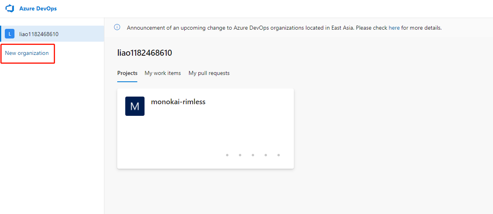
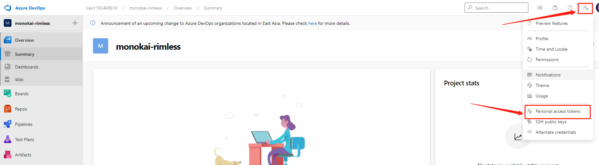
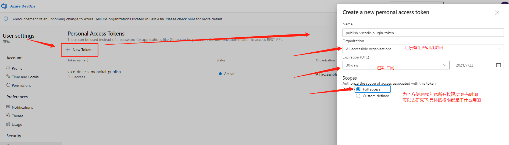
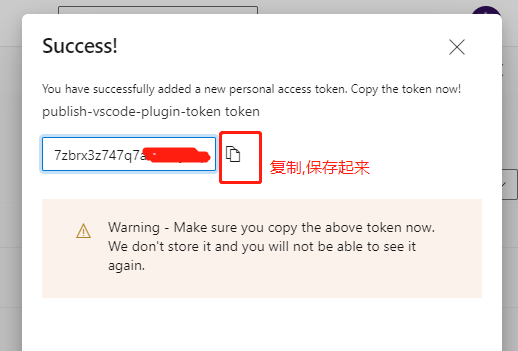
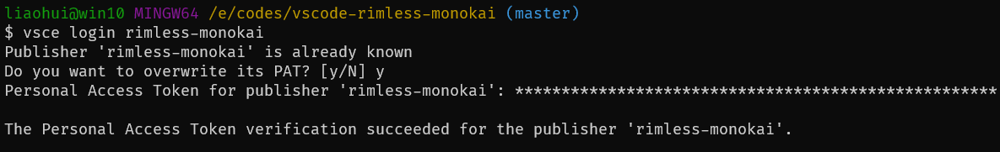
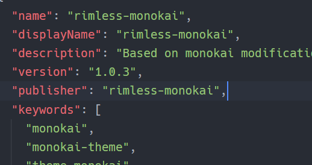
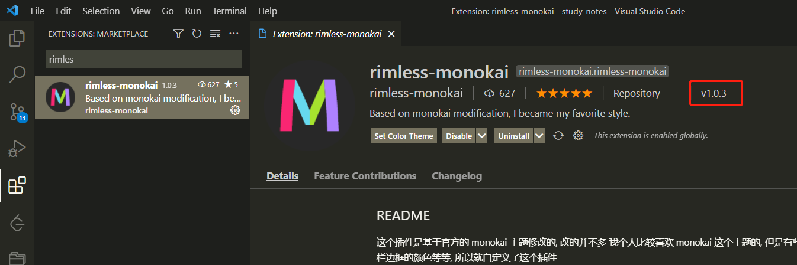

## 相关文档(建议阅读)

- [快速开始](https://liiked.github.io/VS-Code-Extension-Doc-ZH/#/get-started/your-first-extension)

## 安装相关工具

```bash
npm i yo generator-code vsce
```

- [yoman](https://yeoman.io/) 快速生成插件模板
- [vsce](https://github.com/microsoft/vscode-vsce) 发布插件到插件市场

## 开发

开发相关操作,请查看文档,毕竟插件功能不一样,不可能去开发一个插件然后记录笔记

## 发布

### 准备工作

- 注册一个微软账号, 这个没什么好说的
- 登录 [azure](https://dev.azure.com/)

### 发布步骤

1. 创建一个组织: new_organization, 我这里创建了一个 `rimless-monokai`



2. 进入组织主页, 去创建一个 `token`



3. 创建 token, 勾选相关选项(注意访问权限选项)



4. 保存 token



5. 使用 vsce 登录, 此时会让你输入token, 就是之前在 azure 中创建的那个 token

```bash
# vsce login 组织名
vsce login rimless-monokai
```



6. 发布
  1. 注意 `packge.json` 版本号
  2. 发布成功后, 需要等个3分钟左右才能在插件商店中看到最新版本
```bash
vsce publish
```




