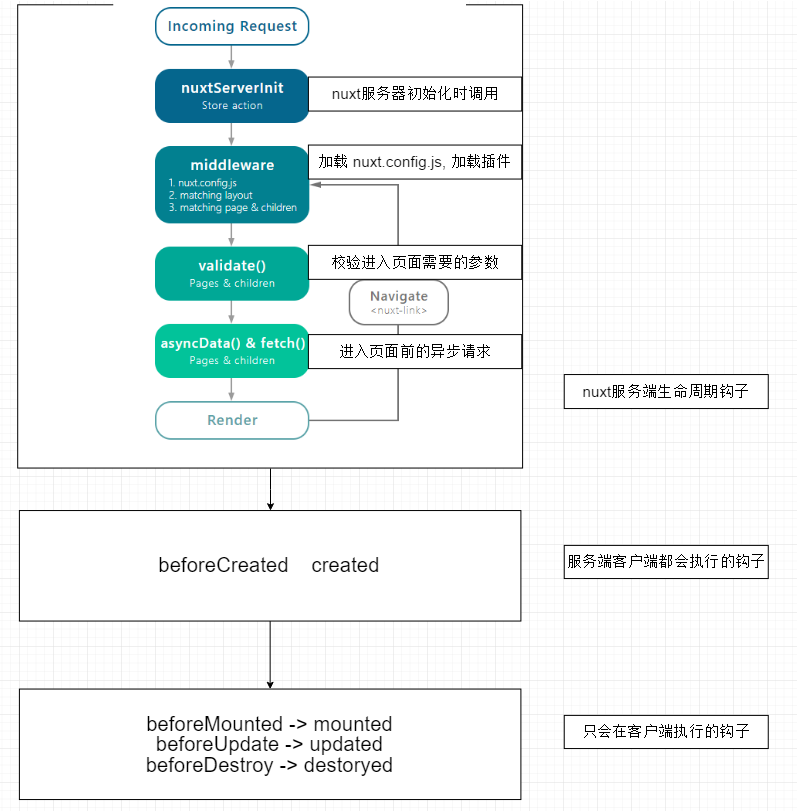

### 相关文档
- [nuxt.js 中文文档](https://www.nuxtjs.cn/guide/installation)

### 下载安装

```sh
npx create-nuxt-app nuxt-demo
```

### 路由

- [nuxt 文档-路由](https://www.nuxtjs.cn/guide/routing)
- 跳转的时候不要使用 a 标签, 容易出现 bug, 要用 nuxt-link
- 编程式导航还是和 vue-cli 创建的项目一模一样

### 生命周期



### 加载设置全局样式(scss/less/css)

- 安装对应模块

```sh
npm i @nuxtjs/style-resources
```

- 修改配置文件 `nuxt.config.js`

```js
modules: [
  // ...
  '@nuxtjs/style-resources',
],
```

- 导入全局样式 `nuxt.config.js`

```js
  css: [
    // 重置浏览器样式
    '~/assets/css/reset.css',

    // 全局scss 变量
    '~/assets/scss/var.scss',

    // 动画库 animate.css
    '~/assets/css/animate.min.css'
  ],
```

### 设置页面的 seo 信息

- 全局设置: 在 `nuxt.config.js` 中设置 `head` 选项

- 局部设置: 在组件中添加 head 方法

```js
export default {
  head() {
    return {
      title: '这是页面标题',
      meta: [
        { charset: 'utf-8' },
        { name: 'viewport', content: 'width=device-width, initial-scale=1' },
        {
          hid: 'description',
          name: 'description',
          content: '这是一个描述'
        }
      ],
    };
};
```

### jwt 登录验证中间件

- cookie
- nuxtServerInit
- vuex
- [nuxt-auth-demo](https://gitee.com/liaohui5/nuxt-auth-demo) 这个是请求第三方服务器, 如果在客户端直接请求nuxt服务器, 不需要使用这个

### axios 模块和原生的 axios 的不同

- https://axios.nuxtjs.org/helpers.html

### 判断代码运行环境

- [dotenv](https://github.com/nuxt-community/dotenv-module#readme) 可以直接在安装的时候勾选
- process.env.client 判断是否是客户端(并不一定是浏览器)
- process.env.browser 判断是否是浏览器环境
- process.env.server 判断是否是 nuxt 服务器环境
