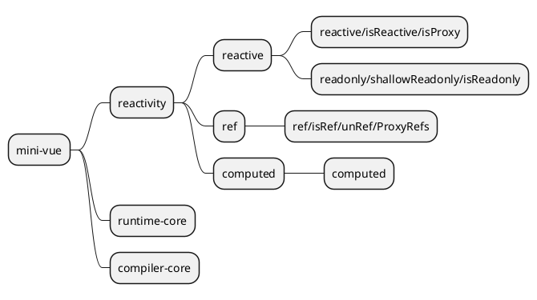

## 什么是声明式/指令式编程?

### 指令式(Imperative)

使用详细的指令去处理一件事情来达到你预期的结果

```js
// 比如: 我想从所有数据 data 中找到, 字段 name 为 "tom" 那一条
// 1. 遍历所有数据
// 2. 判断条件
// 3. 输出到控制台并且停止循环

let item;
for (let i = 0; i < data.length; i++) {
  item = data[i];
  if (item.name === 'tom') {
    console.log(item);
    break;
  }
}
```

### 声明式(Declarative)

按照规定的语法, 只是声明我想要的结果, 并不关心如何实现

```sql
SELECT * FROM `users` WHERE `users`.`name` = "tom";
```

## 核心源码

1. runtime-core: 运行时核心
2. compiler-core: 编译器核心
3. reactivity: 响应式 API


## API 实现



