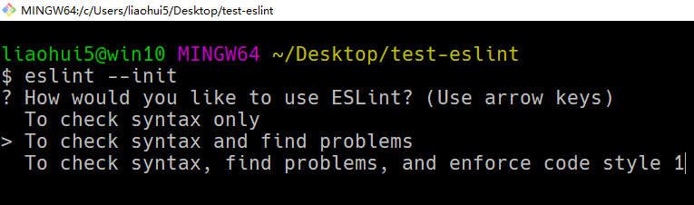
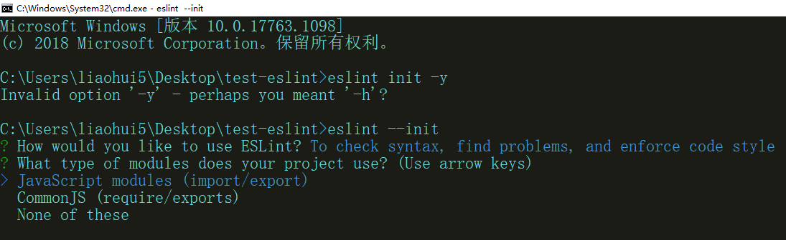
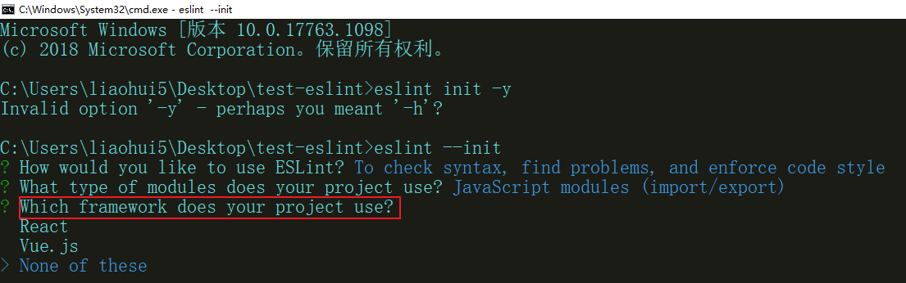
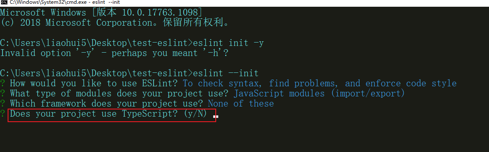
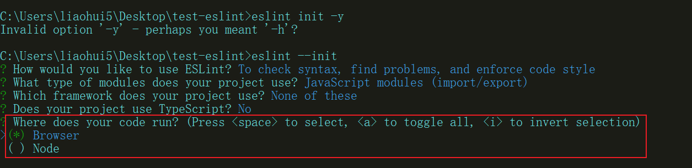
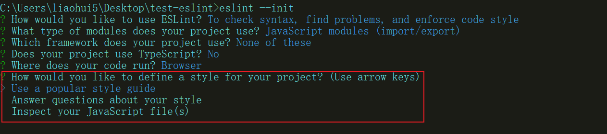
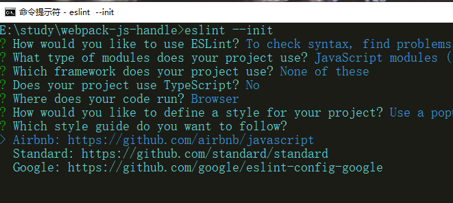
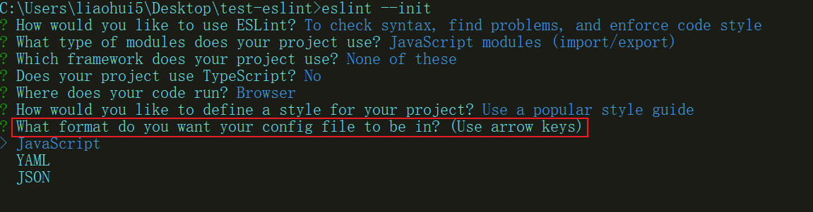
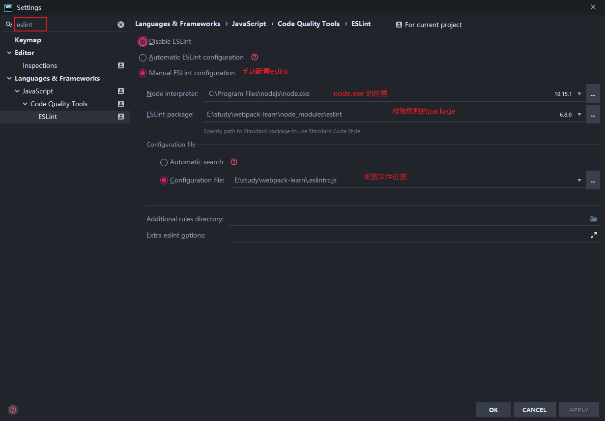
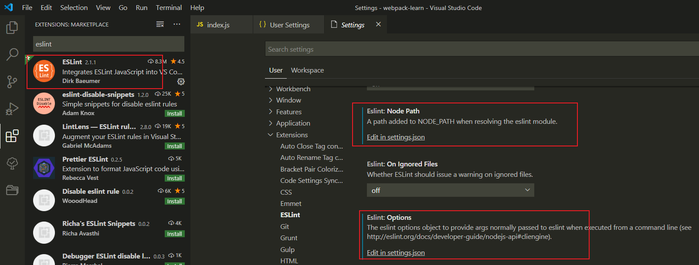

### 检查代码规范

- [中文文档](http://eslint.cn/)

### 安装

- eslint 是一个工具
- eslint-loader 则是将 eslint 继承到 webpack 的一个 loader

```sh
npm i eslint eslint-loader -D
```

### 按照提示生成配置文件

```sh
eslint --init
```

> 选择如何使用 eslint

- `只检查语法` : To check syntax only
- `检查语法找出问题` : To check syntax and find problems
- `检查语法找出问题并强制约束代码风格` : To check syntax, find problems, and enforce code style



> 使用什么规范模块化

- `es6 模块化` : JavaScript modules (import/export)
- `commonJS模块化` : CommonJS (require/exports)
- `None of these` : 不使用模块化



> 使用什么框架?

- react
- vue.js
- 不使用框架



> 项目是否使用 typescript



> 选择代码运行的环境

- browser: 浏览器环境
- node: 服务端 nodejs 环境



> 如何约束代码风格

- `使用知名的代码规范(推荐)` Use a popular style guide





> 使用什么格式的配置文件保存 eslint 的配置



### 如何在写代码的时候提示错误, 校验代码风格

全部选择后, 会安装一些必要的包, 安装完之后, 需要配置编辑器

- 设置 webstorm



- 设置 vscode


